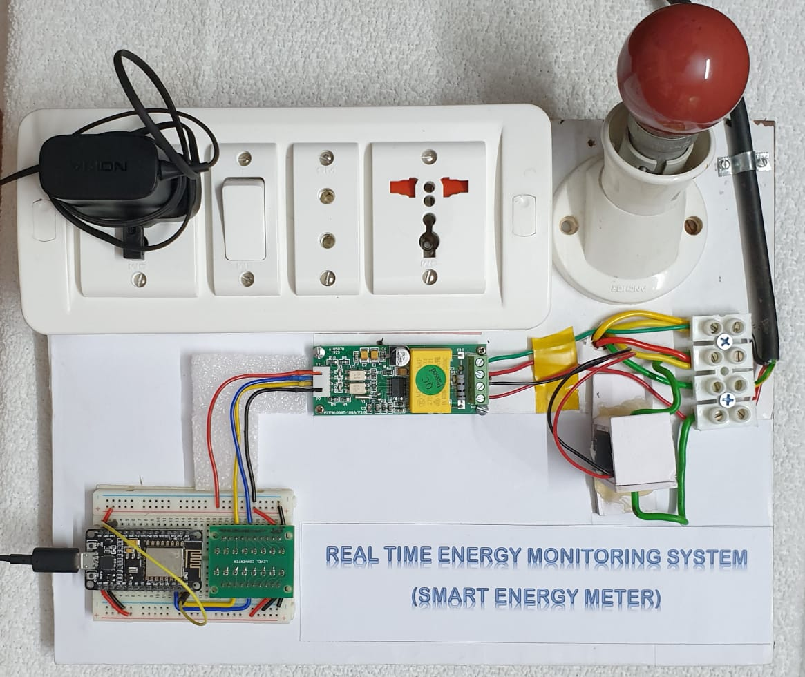
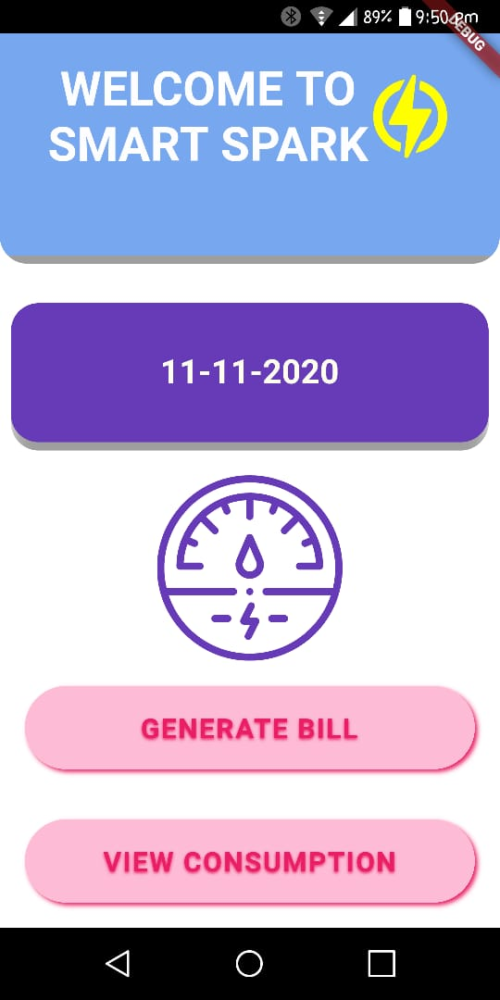
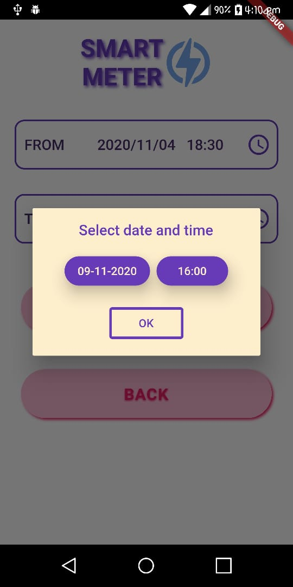
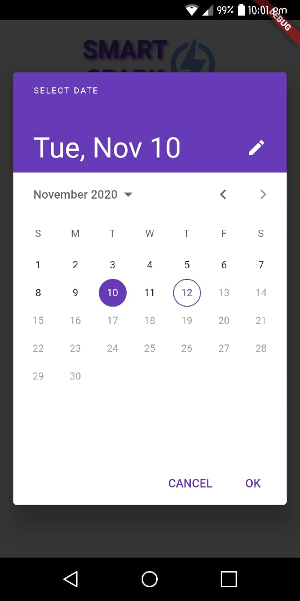
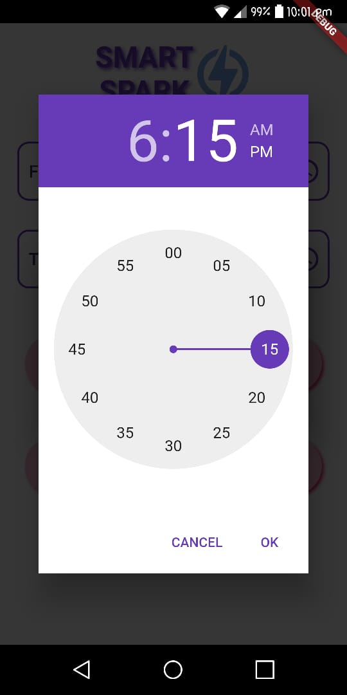
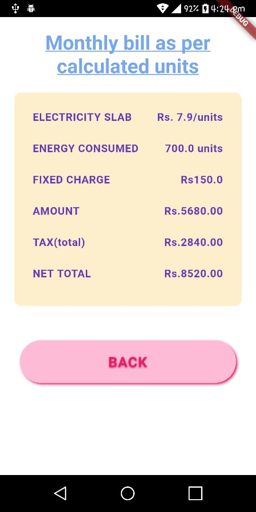

# DSCWOW-SmartSpark

A smart energy monitoring system app that enables user to see their live energy consumption details along with the bill  
For working demo of the project <a href="https://youtu.be/NMaJGlikHAU" target="_blank">click here</a>. 
<h2>HARDWARE</h2>

The hardware comprises of a
<b>
  <a href="https://www.amazon.in/xcluma-PZEM-004T-80-260V-voltage-communication/dp/B0823P417C" target="_blank">PZEM-004T module</a>
</b>, a 
<b>
  <a href="https://www.amazon.in/Robo-India-LLC-1-Converter-Bi-Directional/dp/B018FNN898/ref=sr_1_13?dchild=1&keywords=level+shifter+3.3v+to+5v&qid=1604864039&sr=8-13" target="_blank">Voltage level converter</a>
</b>, an 
<b>
  <a href="https://www.amazon.in/Generic-Nodemcu-Esp8266-Internet-Development/dp/B07262H53W/ref=sr_1_1?dchild=1&keywords=nodemcu&qid=1604864220&sr=8-1" target="_blank">ESP8266 NodeMUCU</a>
</b> 
and provisions for providing different <b>Loads</b>. The below figure shows the hardware setup.

 
 

### Hardware Setup

<h3>WORKING</h3>
When the supply is on, the PZEM module starts monitoring the various electrical factors. The NODEMCU is programmed with <b>deep sleep mode</b> and recieves data from the PZEM after every sleep interval.This value is given to <b>Google sheets</b> which acts as the server that stores the sensor data. A <b>google script code</b> is written in the <b>script editor</b> of the sheet to write the sensor value to sheets. A code(also written in the same script editor) is used to send every new data written in sheets to <b>Firebase database</b>. The <b>Firestore</b> database of firebase is used to store the values, which is used as the backend of the <b>Mobile Application</b>.
 
 
To know more about the hardware components click below👇🏻
  

   

## App preview

### Interface

 

 
 

### Giving user inputs

   

 
 

### Output preview

  

